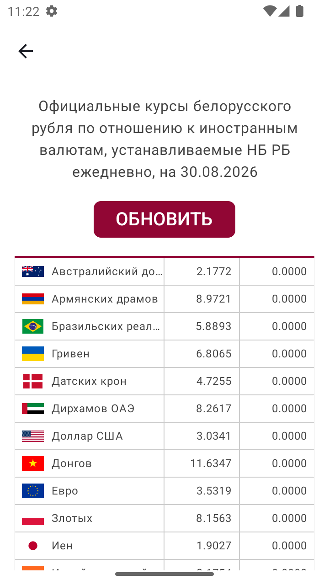
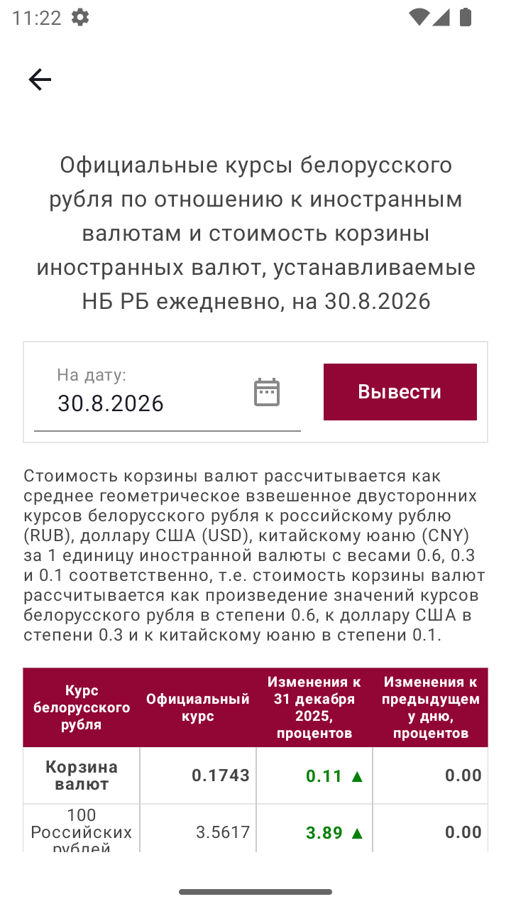
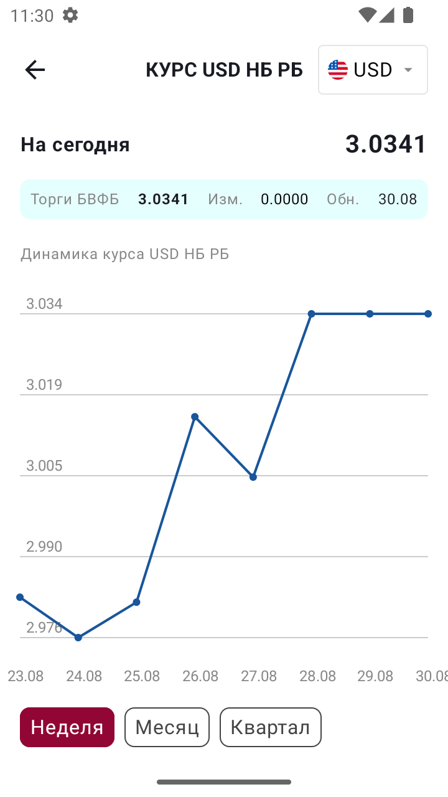

# Exchange Rates / Курсы валют

Android, Compose, Compose Navigation, Hilt, Kotlin Serialization, Retrofit, Coil, Room, Kotlin Datetime

<table>
  <tr>
    <td></td>
  </tr>
  <tr>
    <td></td>
  </tr>
  <tr>
    <td></td>
  </tr>
</table>